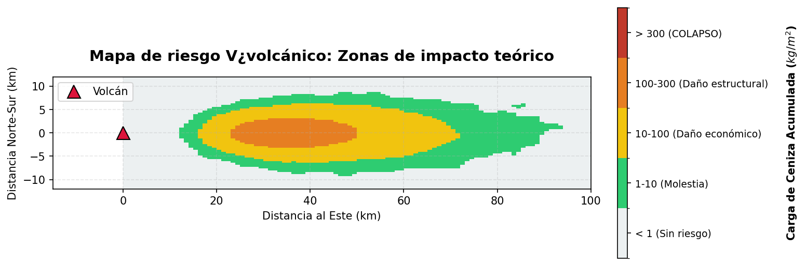

# Simulación de dispersión de ceniza volcánica: Modelado estocástico

**¿Podemos predecir el riesgo volcánico usando física y Python?**

Este proyecto desarrolla un motor computacional basado en física para simular el transporte atmosférico de ceniza volcánica utilizando **Ecuaciones Diferenciales Estocásticas de Langevin (SDEs)**. Diseñado como una alternativa ligera a los modelos meteorológicos complejos, ofrece capacidades de evaluación rápida de riesgos y reconstrucción histórica.

> 🇺🇸 [English Version](./README.md)


*Simulación de partículas lagrangianas visualizando las primeras 5 horas de la erupción del Calbuco en 2015. Las partículas rojas representan el frente activo de la pluma impulsado por vectores de viento y turbulencia atmosférica.*

---

## Flujo de trabajo y resultados

Este proyecto se estructura en dos etapas analíticas: primero, el desarrollo de un motor de riesgo probabilístico (Notebook 2), y segundo, su validación frente a un evento histórico (Notebook 3).

### Etapa 1: Evaluación probabilística de riesgo
Más allá de la animación, el valor central de este proyecto es la **evaluación de riesgo**.
Al ejecutar miles de simulaciones de Monte Carlo, el motor genera un **mapa de calor de probabilidad** para identificar zonas de peligro.

<div align="center">
  
</div>

* *Nota: Este resultado estadístico permite a las autoridades tomar decisiones basadas en datos bajo incertidumbre.*

### Etapa 2: Validación histórica
Para verificar la precisión física del motor, calibré el modelo para replicar la **erupción del volcán Calbuco de 2015**. Comparé la simulación contra el modelo atmosférico **NOAA HYSPLIT** para la misma fecha exacta (22 de abril de 2015).

<table>
  <tr>
    <td align="center"><b>Simulación estocástica (Python)</b></td>
    <td align="center"><b>Modelo NOAA HYSPLIT (Referencia)</b></td>
  </tr>
  <tr>
    <td align="center"></td>
    <td align="center"></td>
  </tr>
  <tr>
    <td align="center"><i>Resultado: Trayectoria noreste (NE)</i></td>
    <td align="center"><i>Resultado: Coincide con trayectoria a 15 km</i></td>
  </tr>
</table>

---

## Impacto y conclusiones
El modelo replicó con éxito el comportamiento macroscópico de una erupción estratosférica utilizando recursos computacionales limitados. Los hallazgos clave incluyen:

* **Validación de trayectoria:** La simulación predijo correctamente la llegada de ceniza a **San Carlos de Bariloche (~100 km de distancia)** en aproximadamente **1.5 horas**, coincidiendo con los reportes de protección civil de 2015.
* **Eficiencia:** A diferencia de modelos meteorológicos complejos (Navier-Stokes) que requieren supercomputadoras, este enfoque estocástico corre en una laptop estándar en minutos, sirviendo como una "aproximación de primer orden" efectiva para la evaluación rápida de riesgos.
* **Precisión fenomenológica:** La inclusión de un término de difusión estocástica permitió al modelo replicar la dispersión en forma de "abanico" observada en las imágenes satelitales de la NASA, algo que los modelos lineales no logran capturar.

## Desafíos técnicos y soluciones
Fui más allá del análisis de datos estándar para implementar simulaciones físicas:

* **De determinista a estocástico:** En lugar de un movimiento lineal simple, implementé la **ecuación de Langevin** para modelar la turbulencia atmosférica como una caminata aleatoria (Proceso de Wiener).
* **Vectorización:** Para simular miles de partículas eficientemente, evité los bucles de Python y utilicé la vectorización de `NumPy`, calculando el estado de todo el sistema en operaciones matriciales.
* **Mapeo geoespacial:** La salida matemática (coordenadas cartesianas) fue transformada en coordenadas geoespaciales (Lat/Lon) para proyectar la física abstracta en un mapa interactivo real usando `Folium`.
* **Calibración de parámetros:** El modelo requirió ajustar los vectores de viento ($v_x, v_z$) basándose en análisis vectoriales históricos para coincidir con la trayectoria noreste específica del evento de 2015.

## Cómo ejecutar este proyecto localmente

### 1. Configuración (Parámetros de simulación)
A diferencia de los proyectos típicos de análisis de datos, esta simulación genera sus propios datos. Puedes ajustar la física en la sección `CONFIG` del **Notebook 3**:

* **Física del viento:** Ajusta `VX` (viento zonal) y `VZ` (viento meridional) para cambiar la dirección de la pluma.
* **Potencia de erupción:** Modifica `ALTURA_COLUMNA` (por defecto: 17,000m) para simular diferentes índices de explosividad volcánica (VEI).
* **Turbulencia:** Cambia el coeficiente de difusión `D` para hacer la nube de ceniza más compacta (valor bajo) o más dispersa (valor alto).

### 2. Instalación y ejecución

1. **Clonar el repositorio:**
   ```bash
   git clone https://github.com/FernandaVil/Volcanic-Ash-Simulation.git
2. **Navegar a la carpeta:**
    ```bash
      cd Volcanic-Ash-Simulation
3. **Instalar dependencias:**
    
    ```bash
      pip install -r requirements.txt
  (Librerías principales: numpy, folium, matplotlib, scipy)
  
4. **Ejecución:** Abrir los notebooks en orden.
  * 01_Ecuacion_Langevin.ipynb: Fundamentos teóricos y pruebas en 1D.

  * 02_Motor_Fisico_2D.ipynb: **(Etapa 1)** Desarrollo del motor físico.

  * 03_Validacion_Calbuco.ipynb: **(Etapa 2)** Simulación geoespacial final y validación.

 ## Estructura del proyecto
  ```bash
      Volcanic-Ash-Simulation/
      ├── assets/                  <-- Imágenes y GIFs para el README
      ├── output/                  <-- Mapa HTML generado
      ├── 1_Ecuacion_Langevin.ipynb
      ├── 2_Motor_Fisico_2D.ipynb
      ├── 3_Validacion_Calbuco.ipynb
      ├── requirements.txt
      └── README.md
 ```

* `03_Validacion_Calbuco.ipynb`: Notebook principal con el flujo completo de simulación.
* `output/`: Contiene el archivo interactivo mapa_calbuco_final.html.
* `requirements.txt`: Librerías requeridas para la ejecución.

## Referencias y fuentes de datos

Para asegurar la fidelidad física de la simulación, los parámetros y datos de validación fueron obtenidos de repositorios científicos oficiales:

* **Imágenes satelitales (Validación):**
    * **NASA Earth Observatory:** *Eruption of Calbuco Continues*. Obtenido de [science.nasa.gov](https://science.nasa.gov/earth/earth-observatory/eruption-of-calbuco-continues-85779/).
    * *Instrumento:* MODIS en satélite Terra.

* **Datos de trayectoria (Validación):**
    * **LALINET (Latin American Lidar Network):** *Calbuco Volcano Campaign 2015*. Obtenido de [lalinet.org](https://www.lalinet.org/campaigns/cabulco-volcano-2015/20150423argentinacalipso).
    * *Datos:* Trayectorias directas del modelo NOAA HYSPLIT (22-23 de abril).

* **Parámetros físicos:**
    * **SERNAGEOMIN:** Reportes técnicos de actividad volcánica (2015).
    * **Global Volcanism Program:** Historia eruptiva y datos de altura de pluma.
---
*Proyecto desarrollado como una exploración personal en modelado estocástico y análisis geoespacial.*
