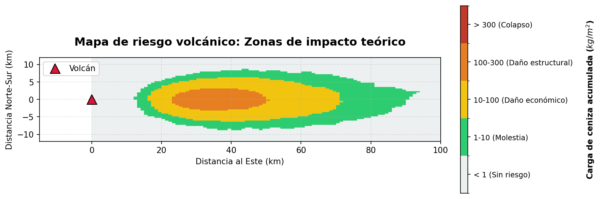
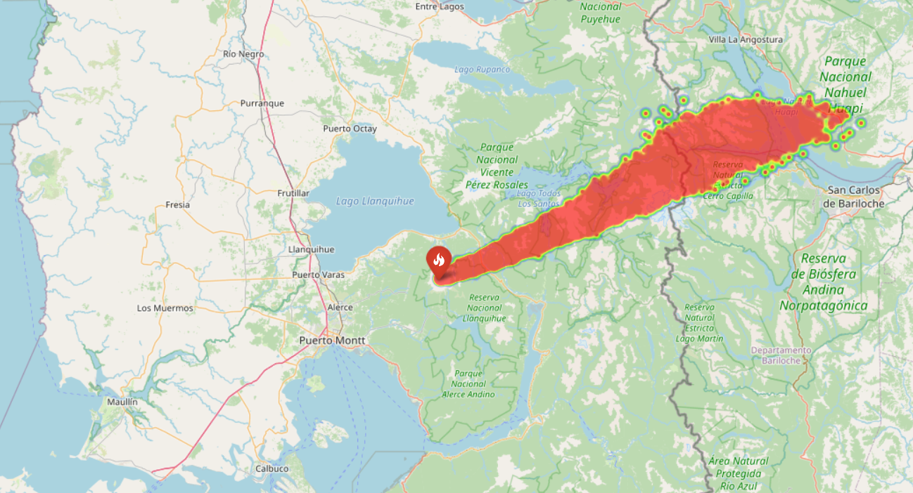
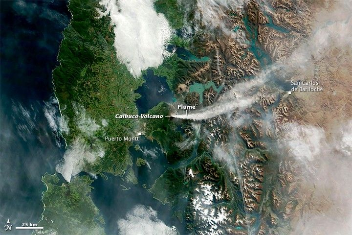

# Simulación de dispersión de ceniza volcánica: Modelado estocástico

**¿Podemos predecir el riesgo volcánico usando física y Python?**

Este proyecto desarrolla un motor computacional basado en física para simular el transporte atmosférico de ceniza volcánica utilizando **Ecuaciones Diferenciales Estocásticas de Langevin (SDEs)**. Diseñado como una alternativa ligera a los modelos meteorológicos complejos, ofrece capacidades de evaluación rápida de riesgos y reconstrucción histórica.

> 🇺🇸 [English Version](./README.md)


*Simulación de partículas lagrangianas visualizando las primeras 5 horas de la erupción del Calbuco en 2015. Las partículas rojas representan el frente activo de la pluma impulsado por vectores de viento y turbulencia atmosférica.*

---

## Flujo de trabajo y resultados

El motor está diseñado para operar en dos modos analíticos distintos, sirviendo a diferentes etapas de la gestión de desastres:

### Modo 1: Evaluación Preventiva (Riesgo probabilístico)
*Enfoque: Análisis estadístico (Notebook 2)*

Antes de aplicar el modelo a un mapa real, el motor utiliza simulaciones de Monte Carlo con datos de viento sintéticos para generar un mapa de calor de riesgo. Al calcular la densidad de partículas por unidad de cuadrícula, identificamos zonas teóricas de acumulación.

<div align="center">
  
  <p><i> Mapa de Riesgo (Escenario de control). Resultado de una simulación de Monte Carlo con 50,000 partículas.</i></p>
</div>

* *Nota: Este resultado estadístico permite a las autoridades tomar decisiones basadas en datos bajo incertidumbre.*

### Modo 2: Validación Histórica (Calbuco 2015)
*Enfoque: Física y dinámica (Notebook 3)*

Para verificar la precisión del motor, contrastamos la simulación con imágenes satelitales reales de la erupción. El modelo logró replicar la dispersión en forma de "abanico" y la dirección Noreste.

<table>
  <tr>
    <td align="center"><b>Simulación Estocástica (Python)</b></td>
    <td align="center"><b>Realidad (Satélite NASA MODIS)</b></td>
  </tr>
  <tr>
    <td align="center"></td>
    <td align="center"></td>
  </tr>
  <tr>
    <td align="center"><i>Predicción: Dispersión NE y ensanchamiento</i></td>
    <td align="center"><i>Observación: Pluma real sobre Argentina</i></td>
  </tr>
</table>

> **Nota técnica:** La trayectoria también fue validada contra los modelos de trayectoria NOAA HYSPLIT, obteniendo una coincidencia en los tiempos de arribo a zonas urbanas (Ver *Notebook 3* para el análisis detallado).
---

## Impacto y conclusiones
El modelo replicó con éxito el comportamiento macroscópico de una erupción estratosférica utilizando recursos computacionales limitados. Los hallazgos clave incluyen:

* **Validación de trayectoria:** La simulación predijo correctamente la llegada de ceniza a **San Carlos de Bariloche (~100 km de distancia)** en aproximadamente **1.5 horas**, coincidiendo con los reportes de protección civil de 2015.
* **Eficiencia:** A diferencia de modelos meteorológicos complejos (Navier-Stokes) que requieren supercomputadoras, este enfoque estocástico corre en una laptop estándar en minutos, sirviendo como una "aproximación de primer orden" efectiva para la evaluación rápida de riesgos.
* **Precisión fenomenológica:** La inclusión de un término de difusión estocástica permitió al modelo replicar la dispersión en forma de "abanico" observada en las imágenes satelitales de la NASA, algo que los modelos lineales no logran capturar.

## Desafíos técnicos y soluciones
Fui más allá del análisis de datos estándar para implementar simulaciones físicas:

* **De determinista a estocástico:** En lugar de un movimiento lineal simple, implementé la **ecuación de Langevin** para modelar la turbulencia atmosférica como una caminata aleatoria (Proceso de Wiener).
* **Vectorización:** Para simular miles de partículas eficientemente, evité los bucles de Python y utilicé la vectorización de `NumPy`, calculando el estado de todo el sistema en operaciones matriciales.
* **Mapeo geoespacial:** La salida matemática (coordenadas cartesianas) fue transformada en coordenadas geoespaciales (Lat/Lon) para proyectar la física abstracta en un mapa interactivo real usando `Folium`.
* **Calibración de parámetros:** Las constantes físicas (altura de la columna >15km y trayectoria NE) fueron calibradas usando reportes oficiales del Smithsonian Institution (GVP, 2015), asegurando que la simulación refleja las ocndiciones atmosféricas reales del evento del 2015.

## Cómo ejecutar este proyecto localmente

### 1. Configuración (Parámetros de simulación)
A diferencia de los proyectos típicos de análisis de datos, esta simulación genera sus propios datos. Puedes ajustar la física en la sección `CONFIG` del **Notebook 3**:

* **Física del viento:** Ajusta `VX` (viento zonal) y `VZ` (viento meridional) para cambiar la dirección de la pluma.
* **Potencia de erupción:** Modifica `ALTURA_COLUMNA` (por defecto: 17,000m) para simular diferentes índices de explosividad volcánica (VEI).
* **Turbulencia:** Cambia el coeficiente de difusión `D` para hacer la nube de ceniza más compacta (valor bajo) o más dispersa (valor alto).

### 2. Instalación y ejecución

1. **Clonar el repositorio:**
   ```bash
   git clone https://github.com/FernandaVil/Volcanic-Ash-Simulation.git
2. **Navegar a la carpeta:**
    ```bash
      cd Volcanic-Ash-Simulation
3. **Instalar dependencias:**
    
    ```bash
      pip install -r requirements.txt
  (Librerías principales: numpy, folium, matplotlib, scipy)
  
4. **Ejecución:** Abrir los notebooks en orden.
  * 01_Ecuacion_Langevin.ipynb: Fundamentos teóricos y pruebas en 1D.

  * 02_Motor_Fisico_2D.ipynb: **(Modo 1)** Desarrollo del motor físico.

  * 03_Validacion_Calbuco.ipynb: **(Modo 2)** Simulación geoespacial final y validación.

## Mejoras Futuras
Aunque la versión actual valida exitosamente el motor físico, futuras iteraciones podrían incluir:

* Integración del pipeline: Unificar el motor de riesgo (Modo 1) con la calibración histórica (Modo 2) para generar mapas de riesgo en tiempo real conectando el sistema a APIs de clima en vivo.
* Análisis demográfico: Cruzar el mapa de calor con datos de densidad poblacional para estimar civiles afectados automáticamente.
* Visualización 3D: Extender el mapa 2D de Folium a un modelo de terreno 3D utilizando herramientas como Cesium o Deck.gl para visualizar la compleja interacción entre la pluma de ceniza y la topografía de la cordillera de los Andes.

 ## Estructura del proyecto
  ```bash
      Volcanic-Ash-Simulation/
      ├── assets/                  <-- Imágenes y GIFs para el README
      ├── output/                  <-- Mapa HTML generado
      ├── 1_Ecuacion_Langevin.ipynb
      ├── 2_Motor_Fisico_2D.ipynb
      ├── 3_Validacion_Calbuco.ipynb
      ├── requirements.txt
      └── README.md
 ```

* `03_Validacion_Calbuco.ipynb`: Notebook principal con el flujo completo de simulación.
* `output/`: Contiene el archivo interactivo mapa_calbuco_final.html.
* `requirements.txt`: Librerías requeridas para la ejecución.

## Referencias y fuentes de datos

Para asegurar la fidelidad física de la simulación, los parámetros y datos de validación fueron obtenidos de repositorios científicos oficiales:

* **Imágenes satelitales (Validación):**
    * **NASA Earth Observatory:** *Eruption of Calbuco Continues*. Obtenido de [science.nasa.gov](https://science.nasa.gov/earth/earth-observatory/eruption-of-calbuco-continues-85779/).
    * *Instrumento:* MODIS en satélite Terra.

* **Datos de trayectoria (Validación):**
    * **LALINET (Latin American Lidar Network):** *Calbuco Volcano Campaign 2015*. Obtenido de [lalinet.org](https://www.lalinet.org/campaigns/cabulco-volcano-2015).
    * *Datos:* Trayectorias directas del modelo NOAA HYSPLIT (22-23 de abril).

* **Parámetros físicos:**
    * **Global Volcanism Program, 2015**:  *Report on Calbuco (Chile)* (Venzke, E., ed.). Bulletin of the Global Volcanism Network, 40:6. Smithsonian Institution. [https://doi.org/10.5479/si.GVP.BGVN201506-358020](https://doi.org/10.5479/si.GVP.BGVN201506-358020)
---
*Proyecto desarrollado como una exploración personal en modelado estocástico y análisis geoespacial.*
