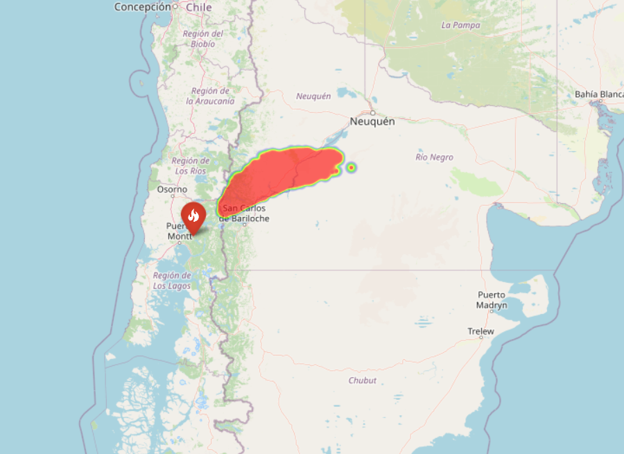
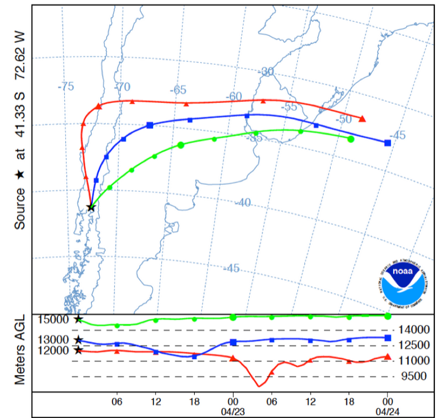

# Volcanic Ash Dispersion Simulation: Stochastic Modeling Engine

**Can we predict volcanic risk using physics and Python?**

This project develops a physics-based computational engine to simulate the atmospheric transport of volcanic ash using **Langevin Stochastic Differential Equations (SDEs)**. Designed as a lightweight alternative to complex meteorological models, it provides rapid risk assessment and historical reconstruction capabilities.


> 🇪🇸 [Versión en Español](./README.es.md)


*Lagrangian particle simulation visualizing the first 5 hours of the 2015 Calbuco eruption. Red particles represent the active plume front driven by wind vectors and atmospheric turbulence*


---

## Project Workflow & Results

This project is structured in two analytical stages: first, developing a probabilistic risk engine (Notebook 2), and second, validating it against a historical event (Notebook 3).

### Stage 1: Probabilistic Risk Assessment
Beyond the animation, the core value of this project is **Risk Assessment**.
By running thousands of Monte Carlo simulations, the engine generates a **Probability Heatmap** to identify danger zones.

<div align="center">
  
</div>

* *Note: This statistical output allows authorities to make data-driven decisions under uncertainty.*
  
### Stage 2: Historical Validation 
To verify the physical accuracy of the engine, I calibrated the model to replicate the **2015 Calbuco Volcano Eruption**. I compared the simulation against the **NOAA HYSPLIT** atmospheric model for the exact same date (April 22, 2015).

<table>
  <tr>
    <td align="center"><b>Stochastic Simulation (Python)</b></td>
    <td align="center"><b>NOAA HYSPLIT Model (Reference)</b></td>
  </tr>
  <tr>
    <td align="center"></td>
    <td align="center"></td>
  </tr>
  <tr>
    <td align="center"><i>Result: Northeast trajectory (NE)</i></td>
    <td align="center"><i>Result: Matches 15km height trajectory</i></td>
  </tr>
</table>

---
## Impact & Conclusions
The model successfully replicated the macroscopic behavior of a stratospheric eruption using limited computational resources. Key findings include:

* **Trajectory Validation:** The simulation correctly predicted the ash arrival in **San Carlos de Bariloche (~100 km distance)** in approximately **1.5 hours**, matching civil protection reports from 2015.
* **Efficiency:** Unlike complex meteorological models (Navier-Stokes) that require supercomputers, this stochastic approach runs on a standard laptop in minutes, serving as an effective "First-Order approximation" for rapid risk assessment.
* **Phenomenological Accuracy:** The inclusion of a stochastic diffusion term allowed the model to replicate the "fan-shaped" dispersion observed in NASA satellite imagery, which linear models fail to capture.

## Technical Challenges & Solutions
I moved beyond standard data analysis to implement physics simulations:

* **From Deterministic to Stochastic:** Instead of simple linear movement, I implemented the **Langevin Equation** to model atmospheric turbulence as a random walk (Wiener Process).
  
* **Vectorization:** To simulate thousands of particles efficiently, I avoided Python loops and utilized `NumPy` vectorization, calculating the state of the entire system in matrix operations.
* **Geospatial Mapping:** The mathematical output (Cartesian coordinates) was transformed into geospatial coordinates (Lat/Lon) to project the abstract physics onto a real interactive map using `Folium`.
* **Parameter Calibration:** The model required tuning the wind vectors ($v_x, v_z$) based on historical vector analysis to match the specific Northeast trajectory of the 2015 event.

## How to Run This Project Locally

### 1. Configuration (Simulation Parameters)
Unlike typical data analysis projects, this simulation generates its own data. You can tweak the physics in the `CONFIG` section of **Notebook 3**:

* **Wind Physics:** Adjust `VX` (Zonal wind) and `VZ` (Meridional wind) to change the plume direction.
* **Eruption Power:** Modify `ALTURA_COLUMNA` (default: 17,000m) to simulate different volcanic explosivity indices (VEI).
* **Turbulence:** Change the Diffusion Coefficient `D` to make the ash cloud more compact (lower value) or more dispersed (higher value).

### 2. Installation & Execution
1. **Clone the repository:**
   ```bash
   git clone https://github.com/FernandaVil/Volcanic-Ash-Simulation.git
2. **Navigate to the folder:**
    ```bash
      cd Volcanic-Ash-Simulation
3. **Install dependencies:**
    
    ```bash
      pip install -r requirements.txt
  (Main libraries: numpy, folium, matplotlib, scipy)
  
4. **Execution:** Open the notebooks in order.
  * 01_Ecuacion_Langevin.ipynb: Theoretical foundation and 1D tests.
  * 02_Motor_Fisico_2D.ipynb:**(Stage 1)** Development of the physics engine.
  * 03_Validacion_Calbuco.ipynb: **(Stage 2)** The final geospatial simulation and validation.

## Project Structure
  ```bash
      Volcanic-Ash-Simulation/
      ├── assets/                  <-- Images and GIFs for README
      ├── output/                  <-- Generated HTML map
      ├── 01_Ecuacion_Langevin.ipynb
      ├── 02_Motor_Fisico_2D.ipynb
      ├── 03_Validacion_Calbuco.ipynb
      ├── requirements.txt
      └── README.md
 ``` 


* `3_Validacion_Calbuco.ipynb`: Main notebook with the full simulation workflow.
* `output/`: Contains the interactive mapa_calbuco_final.html.
* `requirements.txt`: Required libraries for execution.

## References & Data Sources

To ensure the physical fidelity of the simulation, parameters and validation data were sourced from official scientific repositories:

* **Satellite Imagery (Validation):**
    * **NASA Earth Observatory:** *Eruption of Calbuco Continues*. Retrieved from [science.nasa.gov](https://science.nasa.gov/earth/earth-observatory/eruption-of-calbuco-continues-85779/).
    * *Instrument:* MODIS on Terra Satellite.

* **Trajectory Data (Validation):**
    * **LALINET (Latin American Lidar Network):** *Calbuco Volcano Campaign 2015*. Retrieved from [lalinet.org](https://www.lalinet.org/campaigns/cabulco-volcano-2015).
    * *Data:* NOAA HYSPLIT Forward Trajectories (April 22-23).

* **Physical Parameters:**
    * **SERNAGEOMIN:** Technical Reports on Calbuco Activity (2015).
    * **Global Volcanism Program:** Eruptive history and plume height data.

---
*Project developed as a personal exploration in Stochastic Modeling and Geospatial Analysis.*
